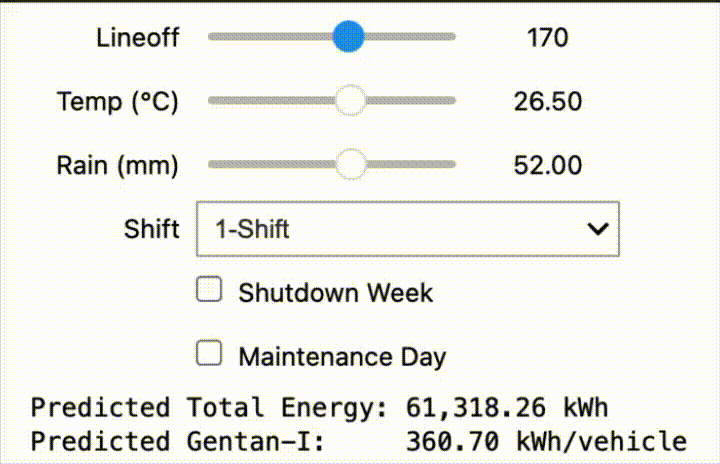
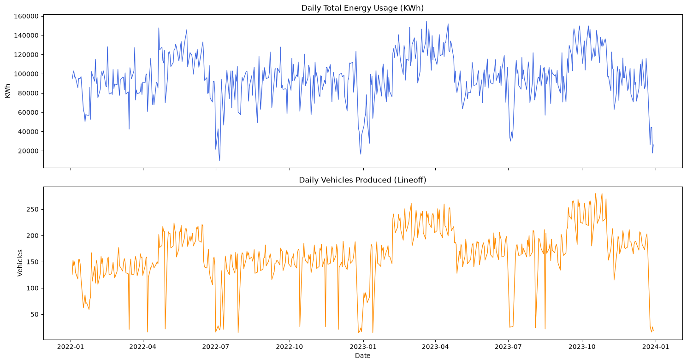
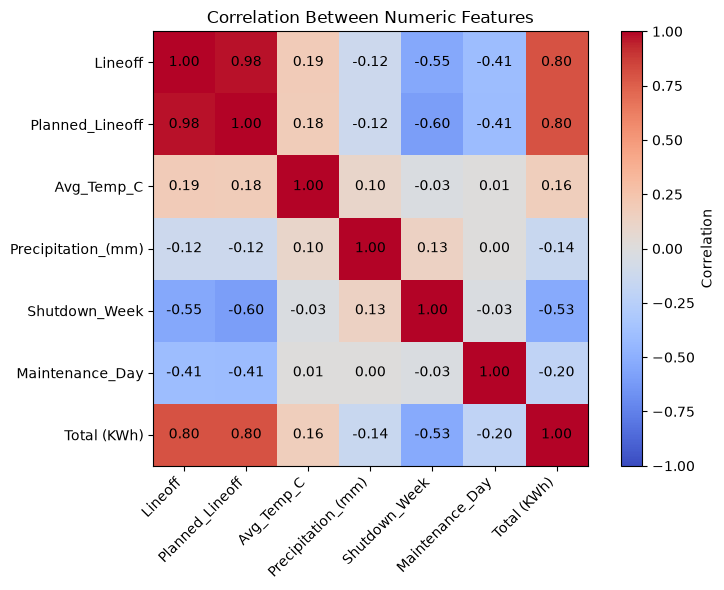
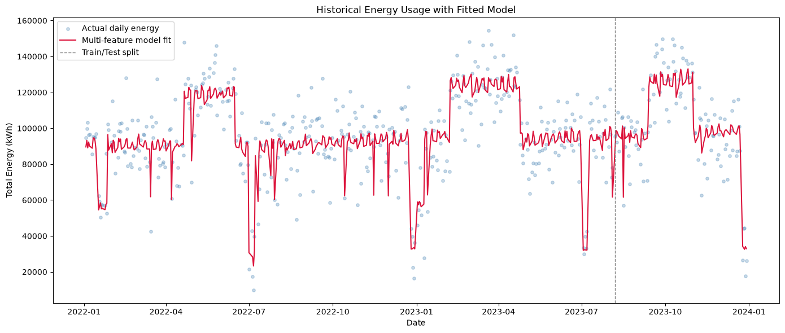
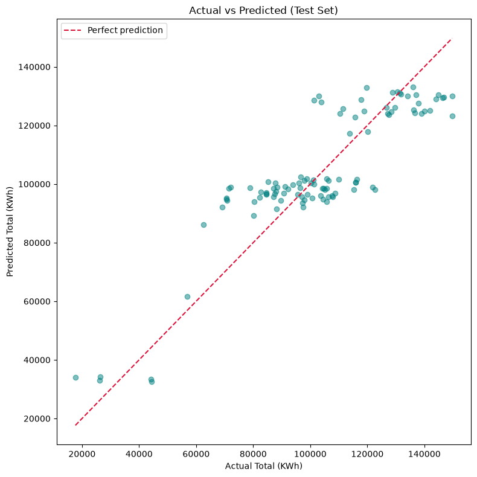
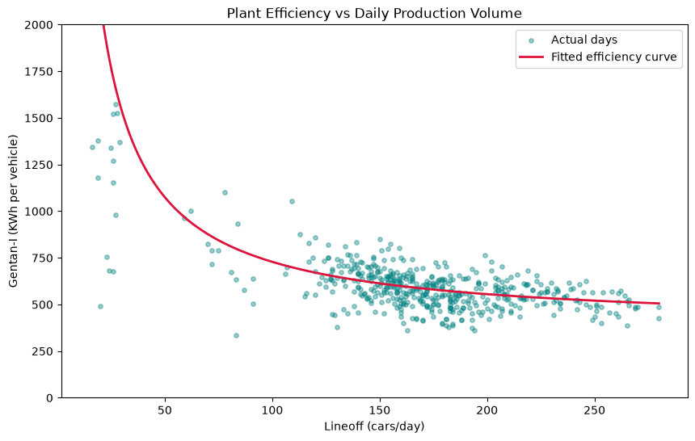

# 🏭 Plant Energy Efficiency Predictor

*A machine learning proof-of-concept inspired by my time as a Plant Engineer at Toyota Indus Motors, Port Qasim, Karachi.*

---

## ⚠️ Disclaimer

**All data used in this project is synthetically generated.** No real, sensitive, or proprietary Toyota production or energy data is used anywhere in this repository. The dataset was built to statistically resemble the *shape* of real plant data (validated against a small real historical sample), with real Karachi weather data layered in for realism, but every production and energy figure is simulated. This project is a personal proof-of-concept exploring an idea from my time on the job. It is not a representation of actual Toyota Indus Motors operations or performance.

---

## Why I built this

During my time as a Plant Engineer at Toyota Indus Motors, one of my core responsibilities was working to optimize the plant's energy usage. Doing that well starts with actually being able to *see* the energy usage clearly in a meaningful way. How much energy the plant uses per vehicle manufactured, and how that number moves with factors like production volume, shift patterns, and weather.

The natural next step from "visualization" is "prediction". If you can reasonably estimate next week's energy usage from a production plan, you can plan more effectively and just as importantly, when actual usage comes in different from the prediction, that gap becomes a genuine signal worth investigating, rather than noise.

This project is my own proof-of-concept exploration of that idea, built from scratch on synthetic data.

---

## What it does

Given a production plan for the upcoming week — projected vehicles per day, expected temperature, expected rainfall, and shift pattern — the model estimates daily and total weekly energy consumption (kWh), and the resulting energy-per-vehicle efficiency (**Gentan-I**).

---

## Visuals

### Interactive daily predictor
A live widget (sliders + dropdown) for exploring how Lineoff, temperature, rain, shift pattern, shutdown/maintenance status affect predicted daily energy and efficiency in real time.

 

### Historical trends
Daily total energy usage and daily vehicles produced (Lineoff) across the full two-year window.

### Feature correlation heatmap
How strongly each numeric feature relates to total energy usage and to each other, before any model is built.

### Historical trend with fitted regression line
The multi-feature model's fitted values overlaid on actual daily energy usage across the full history, with the train/test split point marked.

### Model validation — Actual vs. Predicted
Predicted vs. actual energy usage on the held-out test set — the real test of whether the model generalizes to unseen data.

### Efficiency curve
Energy per vehicle (Gentan-I) plotted against daily production volume, with a fitted efficiency curve — showing the plant getting more efficient per car as volume rises, with diminishing returns at higher output.

---

## The data

520 rows of synthetic daily plant records (Jan 2022 – Dec 2023, weekdays), including:

- `Lineoff` / `Planned_Lineoff` — vehicles actually produced vs. scheduled
- `Total (KWh)` — total plant energy usage for the day
- `Gentan-I (KWh/Veh)` — energy per vehicle, calculated *after the fact* as `Total ÷ Lineoff`
- `Shift_Pattern` — 1/2/3-Shift operation
- `Avg_Temp_C`, `Precipitation_(mm)` — **real historical weather data for the Port Qasim, Karachi area**
- `Shutdown_Week`, `Maintenance_Day` — flags for planned shutdowns and line-down maintenance events

---

## Methodology

### Chronological train/test split
Because this is time series data, the model is trained on the first 80% of dates and tested only on the most recent 20%, not a random shuffle. A random split would let the model "see" future dates while training, which would make the results look better than they'd actually be in real use.

### Linear Regression
The core model is deliberately simple: **Linear Regression**. It's not the fanciest algorithm available, but for this kind of problem that's prefect since it's fast, transparent, and every coefficient it learns is directly interpretable (e.g., "roughly this many extra kWh per additional car," "3-Shift operation adds roughly this much fixed overhead"). For picking up a clear historical trend and giving genuinely useful, explainable insight, it turns out to be very effective.

Two versions were built and compared:

| Model | Features | R² | MAE |
|---|---|---|---|
| Baseline | `Lineoff` only | 0.681 | ~12,347 kWh |
| Multi-feature | `Lineoff` + `Avg_Temp_C` + `Precipitation` + `Shift_Pattern` + `Shutdown_Week` + `Maintenance_Day` | **0.769** | **~10,528 kWh** |

The multi-feature model meaningfully outperforms the naive Lineoff-only baseline, confirming that weather, shift pattern, and shutdown/maintenance status carry real signal — not just Lineoff on its own.

**A known limitation, found through validation:** the model performs well on typical, mid-range production days, but shows a systematic bias at the extremes — it tends to over-predict very low-usage days (shutdowns) and under-predict very high-usage days. This is a well-known behavior of linear regression (it optimizes for average error, pulling extreme predictions toward the mean) and is exactly the kind of finding this project was meant to surface — trust the model most for routine weeks, and sanity-check it more carefully around planned shutdowns or exceptional demand.

---

## Features

- **Interactive daily energy predictor** — an `ipywidgets`-based tool with live sliders and dropdowns for Lineoff, temperature, rainfall, shift pattern, and shutdown/maintenance flags, instantly showing predicted total energy and Gentan-I as inputs change.
- **Weekly forecast planner** — takes a full week's production plan (per-day Lineoff, weather, shift) as input and returns a projected daily and total weekly energy forecast, including a dedicated weekend/day-off handling path that uses an empirical historical average (rather than extrapolating the model to a production volume it's never actually seen).
- **Efficiency curve analysis** — visualizes at what production volume the plant runs most efficiently per vehicle.
- **Full model validation** — historical fit visualization plus an actual-vs-predicted test set chart, so the model's real-world reliability (and its known blind spots) is visible, not just a single accuracy number.

---

## Tech stack

`pandas` · `numpy` · `matplotlib` · `scikit-learn` (LinearRegression) · `ipywidgets`

---

## Possible future improvements

- Non-linear models (e.g. Random Forest, Gradient Boosting) to address the extreme-value bias seen in validation
- Time-series cross-validation instead of a single chronological split
- Lag features / rolling averages to capture short-term momentum in production and energy trends
- Confidence intervals on weekly forecasts, not just point estimates
